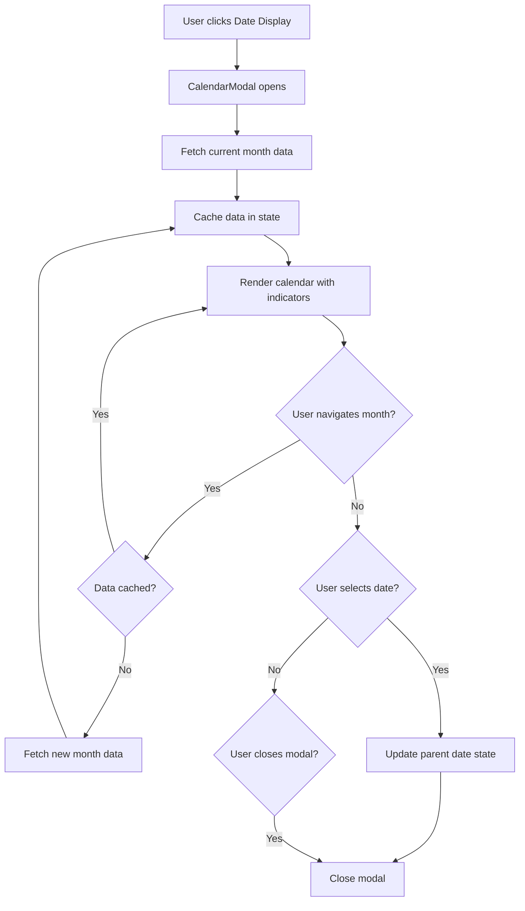

# Design Document: Calendar Modal Access

## Overview

This design document specifies the implementation of an interactive calendar modal feature that enables users to visually browse their historical period and symptom data. The calendar provides a color-coded visual representation of flow intensity and symptom logging history, allowing users to quickly review their menstrual cycle patterns over time.

The feature integrates into the existing Log Symptoms page by making the date display clickable, opening a modal overlay containing a full calendar view. Users can navigate through months, view their historical data with visual indicators, and select dates to quickly navigate to specific days for logging or viewing.

### Key Design Goals

1. **Visual Data Exploration**: Provide an intuitive, color-coded calendar interface for browsing historical period and symptom data
2. **Efficient Data Loading**: Implement smart caching and month-based data fetching to minimize API calls and ensure responsive performance
3. **Seamless Integration**: Integrate naturally with the existing Log Symptoms page without disrupting the current user flow
4. **Responsive Design**: Ensure the calendar works flawlessly on mobile devices (down to 320px width) and desktop screens
5. **Accessibility**: Maintain keyboard navigation support and clear visual indicators for all users

## Architecture

### Component Hierarchy

```
LogPage (existing)
└── CalendarModal (new)
    ├── CalendarHeader (new)
    │   ├── MonthNavigationButton (previous)
    │   ├── MonthYearDisplay
    │   └── MonthNavigationButton (next)
    ├── CalendarGrid (new)
    │   └── CalendarDay[] (new)
    │       ├── DayNumber
    │       ├── FlowIndicator (conditional)
    │       └── SymptomIndicator (conditional)
    └── CalendarLegend (new)
        ├── FlowLegendItem[]
        └── SymptomLegendItem (conditional)
```

### Data Flow



### State Management

The calendar feature uses React local state for managing:

1. **Modal State**: Open/closed status
2. **Current View Month**: The month/year currently displayed
3. **Data Cache**: Map of month keys to symptom log arrays
4. **Loading State**: Per-month loading indicators
5. **Error State**: Error messages for failed data fetches

No global state management is required as the calendar is a self-contained feature within the Log page.

## Components and Interfaces

### 1. CalendarModal Component

**Purpose**: Container component that manages the modal overlay, data fetching, and state coordination.

**Props**:
```typescript
interface CalendarModalProps {
  isOpen: boolean;
  onClose: () => void;
  selectedDate: Date;
  onDateSelect: (date: Date) => void;
  userId: string;
}
```

**State**:
```typescript
interface CalendarModalState {
  currentMonth: Date; // First day of the displayed month
  dataCache: Map<string, SymptomLog[]>; // Key: "YYYY-MM"
  loadingMonths: Set<string>; // Months currently being fetched
  error: string | null;
}
```

**Responsibilities**:
- Render modal overlay with backdrop
- Handle click-outside and Escape key to close
- Coordinate data fetching for displayed month
- Manage data cache to avoid redundant API calls
- Pass data and callbacks to child components

**Key Behaviors**:
- On mount (when opened), fetch data for the current month if not cached
- When month navigation occurs, fetch data for new month if not cached
- Prevent body scroll when modal is open
- Focus trap within modal for accessibility

### 2. CalendarHeader Component

**Purpose**: Display month/year and provide navigation controls.

**Props**:
```typescript
interface CalendarHeaderProps {
  currentMonth: Date;
  onPreviousMonth: () => void;
  onNextMonth: () => void;
  canNavigateNext: boolean; // False if current month
}
```

**Responsibilities**:
- Display formatted month and year (e.g., "January 2024")
- Render previous/next month navigation buttons
- Disable next button when viewing current month

**Styling**:
- Consistent with existing Card header styling
- Navigation buttons use hover states similar to existing UI
- Month/year text is prominent and centered

### 3. CalendarGrid Component

**Purpose**: Render the calendar grid with day cells.

**Props**:
```typescript
interface CalendarGridProps {
  currentMonth: Date;
  symptomLogs: SymptomLog[];
  selectedDate: Date;
  onDateSelect: (date: Date) => void;
  today: Date;
}
```

**Responsibilities**:
- Calculate calendar grid (6 weeks × 7 days)
- Render day-of-week headers (Sun-Sat)
- Create CalendarDay components for each date
- Handle date selection events

**Layout**:
- 7-column grid for days of the week
- 6 rows to accommodate all month variations
- Responsive grid that adapts to screen size

### 4. CalendarDay Component

**Purpose**: Render individual day cell with date number and indicators.

**Props**:
```typescript
interface CalendarDayProps {
  date: Date;
  isCurrentMonth: boolean; // True if date belongs to displayed month
  isToday: boolean;
  isSelected: boolean;
  symptomLog: SymptomLog | null;
  onSelect: (date: Date) => void;
  disabled: boolean; // True for future dates
}
```

**Responsibilities**:
- Display day number
- Render flow intensity indicator if applicable
- Render symptom log indicator if applicable
- Apply appropriate styling for current day, selected day, other month days
- Handle click events for date selection

**Visual States**:
- **Default**: Light background, standard text
- **Other Month**: Muted text color (#9CA3AF)
- **Today**: Border highlight (2px border with primary color)
- **Selected**: Background highlight
- **Has Flow**: Colored dot/circle based on flow intensity
- **Has Symptoms**: Small indicator (e.g., dot) in corner
- **Disabled** (future dates): Reduced opacity, no hover, no click

### 5. CalendarLegend Component

**Purpose**: Explain the meaning of visual indicators.

**Props**:
```typescript
interface CalendarLegendProps {
  showSymptomIndicator: boolean; // True if any logs have symptoms
}
```

**Responsibilities**:
- Display flow intensity color legend (Light, Medium, Heavy)
- Display symptom indicator explanation if applicable
- Use compact, clear layout

**Layout**:
- Horizontal layout on desktop
- Stacked layout on mobile if needed
- Positioned at bottom of modal

## Data Models

### Extended SymptomLog Interface

The existing `SymptomLog` interface from `src/types/index.ts` is sufficient for this feature:

```typescript
interface SymptomLog {
  id: string;
  userId: string;
  date: string; // ISO 8601 string
  flowLevel: 'none' | 'light' | 'medium' | 'heavy';
  painLevel: number;
  mood: 'great' | 'good' | 'neutral' | 'bad' | 'terrible';
  energyLevel: 'high' | 'medium' | 'low';
  sleepHours: number;
  notes?: string;
  symptoms?: string[];
  createdAt: string;
  updatedAt?: string;
}
```

### Calendar Data Cache Structure

```typescript
type MonthKey = string; // Format: "YYYY-MM"

interface CalendarDataCache {
  [monthKey: MonthKey]: {
    logs: SymptomLog[];
    fetchedAt: number; // Timestamp for cache invalidation
  };
}
```

### API Response Format

The calendar will use the existing `/api/symptoms` endpoint with query parameters:

**Request**:
```
GET /api/symptoms?userId={userId}&startDate={YYYY-MM-01}&endDate={YYYY-MM-31}
```

**Response**:
```typescript
{
  success: boolean;
  data: SymptomLog[];
  error?: string;
}
```

## Historical Data Loading and Caching

### Fetching Strategy

1. **Month-Based Fetching**: Fetch data for one month at a time using date range queries
2. **On-Demand Loading**: Only fetch when user navigates to a month
3. **Initial Load**: Fetch current month data when modal opens
4. **Prefetching**: Optionally prefetch adjacent months on idle

### Caching Implementation

```typescript
class CalendarDataCache {
  private cache: Map<string, { logs: SymptomLog[]; fetchedAt: number }>;
  private readonly CACHE_TTL = 5 * 60 * 1000; // 5 minutes

  constructor() {
    this.cache = new Map();
  }

  getMonthKey(date: Date): string {
    return `${date.getFullYear()}-${String(date.getMonth() + 1).padStart(2, '0')}`;
  }

  get(monthKey: string): SymptomLog[] | null {
    const cached = this.cache.get(monthKey);
    if (!cached) return null;

    // Check if cache is still valid
    if (Date.now() - cached.fetchedAt > this.CACHE_TTL) {
      this.cache.delete(monthKey);
      return null;
    }

    return cached.logs;
  }

  set(monthKey: string, logs: SymptomLog[]): void {
    this.cache.set(monthKey, {
      logs,
      fetchedAt: Date.now(),
    });
  }

  clear(): void {
    this.cache.clear();
  }
}
```

### API Integration

Create a new utility function in `src/lib/aws/dynamodb.ts`:

```typescript
export async function getSymptomLogsByMonth(
  userId: string,
  year: number,
  month: number
): Promise<SymptomLog[]> {
  const startDate = new Date(year, month, 1).toISOString();
  const endDate = new Date(year, month + 1, 0, 23, 59, 59).toISOString();
  
  return getSymptomLogsByDateRange(userId, startDate, endDate);
}
```

### Loading States

- **Initial Load**: Show skeleton calendar with loading spinner
- **Month Navigation**: Show loading indicator in header, keep previous month visible
- **Error State**: Display error message with retry button

## Responsive Layout Considerations

### Breakpoints

Following Tailwind CSS conventions:
- **Mobile**: < 640px (sm)
- **Tablet**: 640px - 1024px (sm to lg)
- **Desktop**: > 1024px (lg+)

### Mobile Adaptations (320px - 640px)

1. **Modal Size**: Full-screen modal with small padding
2. **Calendar Grid**: Reduce day cell size to fit 7 columns
3. **Day Numbers**: Smaller font size (text-sm)
4. **Indicators**: Smaller dots/circles (4px instead of 6px)
5. **Legend**: Stack vertically at bottom
6. **Touch Targets**: Minimum 44px × 44px for tap targets
7. **Navigation Buttons**: Larger touch-friendly buttons

### Tablet Adaptations (640px - 1024px)

1. **Modal Size**: 90% width, max 600px
2. **Calendar Grid**: Medium day cell size
3. **Legend**: Horizontal layout

### Desktop (> 1024px)

1. **Modal Size**: Fixed width 700px
2. **Calendar Grid**: Comfortable day cell size
3. **Hover States**: Show hover effects on day cells
4. **Legend**: Horizontal layout with more spacing

### Responsive Grid Implementation

```css
/* Mobile */
.calendar-grid {
  grid-template-columns: repeat(7, minmax(40px, 1fr));
  gap: 2px;
}

/* Tablet */
@media (min-width: 640px) {
  .calendar-grid {
    grid-template-columns: repeat(7, minmax(60px, 1fr));
    gap: 4px;
  }
}

/* Desktop */
@media (min-width: 1024px) {
  .calendar-grid {
    grid-template-columns: repeat(7, minmax(80px, 1fr));
    gap: 6px;
  }
}
```

## Flow Intensity Visualization

### Color Mapping

Following Requirement 4, the exact color codes are:

```typescript
const FLOW_COLORS = {
  none: 'transparent', // No indicator
  light: '#FCA5A5',    // Light pink
  medium: '#EF4444',   // Red
  heavy: '#991B1B',    // Dark red
} as const;
```

### Visual Indicator Design

**Option 1: Filled Circle** (Recommended)
- 6px diameter circle on desktop, 4px on mobile
- Positioned at bottom center of day cell
- Solid fill with flow color

**Option 2: Background Tint**
- Apply flow color as background with 20% opacity
- Covers entire day cell
- More prominent but may interfere with text readability

**Recommendation**: Use Option 1 (filled circle) for clarity and consistency with modern calendar UIs.

### Implementation

```typescript
function FlowIndicator({ flowLevel }: { flowLevel: SymptomLog['flowLevel'] }) {
  if (flowLevel === 'none') return null;

  const color = FLOW_COLORS[flowLevel];

  return (
    <div
      className="w-1.5 h-1.5 sm:w-2 sm:h-2 rounded-full"
      style={{ backgroundColor: color }}
      aria-label={`Flow level: ${flowLevel}`}
    />
  );
}
```

## Symptom Log Indication

### Visual Design

To distinguish symptom indicators from flow indicators:

**Design**: Small dot in top-right corner of day cell
- 4px diameter
- Color: Primary theme color (#E91E63)
- Positioned at top-right corner with 2px offset

### Conditional Display

The symptom indicator appears when:
- A symptom log exists for that date, AND
- The log has at least one of: symptoms array with items, notes, or non-default values for mood/energy/pain

```typescript
function hasSymptomData(log: SymptomLog | null): boolean {
  if (!log) return false;
  
  return (
    (log.symptoms && log.symptoms.length > 0) ||
    (log.notes && log.notes.trim().length > 0) ||
    log.painLevel > 0
  );
}
```

### Implementation

```typescript
function SymptomIndicator({ show }: { show: boolean }) {
  if (!show) return null;

  return (
    <div
      className="absolute top-1 right-1 w-1 h-1 rounded-full bg-primary"
      aria-label="Has symptom data"
    />
  );
}
```

## Current Date Highlighting

### Visual Design

The current date (today) receives special highlighting:
- 2px border with primary color
- Border radius matches day cell
- Does not interfere with flow/symptom indicators
- Distinguishable from selected date styling

### Implementation

```typescript
function CalendarDay({ date, isToday, isSelected, ...props }: CalendarDayProps) {
  const baseClasses = "relative flex flex-col items-center justify-center p-2 rounded-lg";
  const todayClasses = isToday ? "border-2 border-primary" : "";
  const selectedClasses = isSelected ? "bg-primary/10" : "";
  
  return (
    <button
      className={cn(baseClasses, todayClasses, selectedClasses)}
      {...props}
    >
      {/* Day content */}
    </button>
  );
}
```

### Behavior

- Today highlight only appears when viewing the current month
- When navigating to past months, no date receives the today highlight
- Today highlight and flow/symptom indicators can coexist


## Correctness Properties

*A property is a characteristic or behavior that should hold true across all valid executions of a system—essentially, a formal statement about what the system should do. Properties serve as the bridge between human-readable specifications and machine-verifiable correctness guarantees.*

### Property Reflection

After analyzing all acceptance criteria, I identified the following redundancies:

1. **Flow Color Properties (4.1, 4.2, 4.3)**: These three properties all test the same mapping function (flow level → color). They can be combined into a single property that tests the mapping for all flow levels.

2. **Navigation Boundary Properties (2.6, 2.7)**: These test opposite sides of the same boundary (past vs future). They can be combined into a single property about valid navigation ranges.

3. **Date Selection Properties (6.3, 6.5)**: Similar to navigation, these test opposite sides of the date selection boundary. They can be combined.

4. **Indicator Visibility Properties (3.1, 3.2)**: These test the presence/absence of indicators based on data. They can be combined into a single property about indicator display logic.

5. **Symptom Indicator Properties (5.1, 5.3, 5.4)**: These all test aspects of symptom indicator display. Property 5.3 (both indicators) and 5.4 (independence from flow) can be combined into a comprehensive property.

The following properties provide unique validation value and will be included:

### Property 1: Click-outside closes modal

*For any* click event that occurs outside the modal bounds while the modal is open, the modal should close.

**Validates: Requirements 1.3**

### Property 2: Month display completeness

*For any* month and year, the calendar should display all dates belonging to that month (from day 1 to the last day of the month).

**Validates: Requirements 2.1**

### Property 3: Month navigation updates display

*For any* valid month navigation action (previous or next), the calendar should update to display the dates of the new month.

**Validates: Requirements 2.5**

### Property 4: Navigation boundary enforcement

*For any* month, navigation to that month should be allowed if and only if the month is not in the future (i.e., month <= current month).

**Validates: Requirements 2.6, 2.7**

### Property 5: Flow indicator display logic

*For any* date, a flow color indicator should be displayed if and only if a symptom log exists for that date with a flow level other than "none".

**Validates: Requirements 3.1, 3.2**

### Property 6: Flow color mapping correctness

*For any* symptom log with a non-none flow level, the displayed color indicator should match the specified color mapping: light → #FCA5A5, medium → #EF4444, heavy → #991B1B.

**Validates: Requirements 4.1, 4.2, 4.3**

### Property 7: Symptom indicator display with flow independence

*For any* date with a symptom log containing symptom data (symptoms array, notes, or pain level > 0), a symptom indicator should be displayed regardless of the flow level value.

**Validates: Requirements 5.1, 5.3, 5.4**

### Property 8: Date selection closes modal and updates parent

*For any* valid (non-future) date clicked in the calendar, the modal should close and the parent page's selected date should update to the clicked date.

**Validates: Requirements 6.1, 6.2**

### Property 9: Date selection boundary enforcement

*For any* date, selection should be allowed if and only if the date is not in the future (i.e., date <= today).

**Validates: Requirements 6.3, 6.4, 6.5**

### Property 10: Month navigation triggers data fetch

*For any* month navigation to a month not in the cache, a data fetch should be triggered for that month's date range.

**Validates: Requirements 7.2**

### Property 11: Loading indicator during fetch

*For any* data fetch operation, a loading indicator should be visible from the start of the fetch until the fetch completes (success or failure).

**Validates: Requirements 7.3**

### Property 12: Cache prevents redundant fetches

*For any* month that has been successfully fetched and cached, navigating back to that month should not trigger a new fetch request.

**Validates: Requirements 7.5**

### Property 13: Legend visibility with calendar

*For any* state where the calendar component is rendered and visible, the legend should also be rendered and visible.

**Validates: Requirements 8.6**

### Property 14: Current date highlight in current month

*For any* month view, the current date (today) should be visually highlighted if and only if the displayed month is the current month.

**Validates: Requirements 10.1, 10.4**

### Property 15: Current date highlight coexists with flow indicator

*For any* current date that has a symptom log with non-none flow level, both the current date highlight and the flow color indicator should be displayed simultaneously.

**Validates: Requirements 10.3**

## Error Handling

### Network Errors

**Scenario**: API request fails due to network issues or server errors

**Handling**:
1. Catch fetch errors in try-catch block
2. Set error state with user-friendly message
3. Display error message in modal with retry button
4. Log detailed error to console for debugging
5. Do not close modal on error

**Implementation**:
```typescript
try {
  const response = await fetch(`/api/symptoms?userId=${userId}&startDate=${start}&endDate=${end}`);
  if (!response.ok) throw new Error('Failed to fetch symptom data');
  const data = await response.json();
  // Process data
} catch (error) {
  console.error('Error fetching symptom logs:', error);
  setError('Unable to load calendar data. Please try again.');
}
```

### Invalid Date Selection

**Scenario**: User attempts to select a future date (should be prevented by UI)

**Handling**:
1. Disable future date cells (no click handler)
2. Apply disabled styling (reduced opacity, no hover)
3. Add aria-disabled attribute for accessibility
4. If somehow triggered, ignore the selection

### Cache Invalidation

**Scenario**: Cached data becomes stale (user adds new log in another tab)

**Handling**:
1. Implement TTL (Time To Live) for cache entries (5 minutes)
2. Check cache age before using cached data
3. Provide manual refresh option in UI
4. Clear cache when modal closes (optional, based on memory concerns)

### Empty Data States

**Scenario**: User has no symptom logs for a given month

**Handling**:
1. Display calendar normally without indicators
2. No special "empty state" message needed
3. Calendar remains fully functional for date selection

### Modal Focus Management

**Scenario**: Modal opens but focus is not trapped

**Handling**:
1. Use focus trap library or custom implementation
2. Set initial focus to close button or first interactive element
3. Cycle focus within modal when Tab is pressed
4. Return focus to trigger element (date display) when modal closes

## Testing Strategy

### Dual Testing Approach

This feature will be tested using both unit tests and property-based tests to ensure comprehensive coverage:

- **Unit tests**: Verify specific examples, edge cases, and error conditions
- **Property tests**: Verify universal properties across all inputs

Both testing approaches are complementary and necessary for comprehensive coverage. Unit tests catch concrete bugs in specific scenarios, while property tests verify general correctness across a wide range of inputs.

### Property-Based Testing

**Library**: `fast-check` (JavaScript/TypeScript property-based testing library)

**Configuration**:
- Minimum 100 iterations per property test (due to randomization)
- Each property test must reference its design document property
- Tag format: `Feature: calendar-modal-access, Property {number}: {property_text}`

**Property Test Examples**:

```typescript
import fc from 'fast-check';
import { describe, it, expect } from 'vitest';

describe('Feature: calendar-modal-access, Property 4: Navigation boundary enforcement', () => {
  it('should allow navigation to past/current months and prevent future months', () => {
    fc.assert(
      fc.property(
        fc.integer({ min: 2020, max: 2030 }), // year
        fc.integer({ min: 0, max: 11 }), // month (0-11)
        (year, month) => {
          const testDate = new Date(year, month, 1);
          const today = new Date();
          const currentMonth = new Date(today.getFullYear(), today.getMonth(), 1);
          
          const shouldAllowNavigation = testDate <= currentMonth;
          const actuallyAllowed = canNavigateToMonth(testDate);
          
          expect(actuallyAllowed).toBe(shouldAllowNavigation);
        }
      ),
      { numRuns: 100 }
    );
  });
});

describe('Feature: calendar-modal-access, Property 6: Flow color mapping correctness', () => {
  it('should map flow levels to correct colors', () => {
    fc.assert(
      fc.property(
        fc.constantFrom('light', 'medium', 'heavy'),
        fc.date(),
        (flowLevel, date) => {
          const log: SymptomLog = {
            id: 'test',
            userId: 'user',
            date: date.toISOString(),
            flowLevel,
            painLevel: 0,
            mood: 'neutral',
            energyLevel: 'medium',
            sleepHours: 7,
            createdAt: new Date().toISOString(),
          };
          
          const expectedColors = {
            light: '#FCA5A5',
            medium: '#EF4444',
            heavy: '#991B1B',
          };
          
          const actualColor = getFlowColor(log);
          expect(actualColor).toBe(expectedColors[flowLevel]);
        }
      ),
      { numRuns: 100 }
    );
  });
});

describe('Feature: calendar-modal-access, Property 12: Cache prevents redundant fetches', () => {
  it('should not fetch data for already-cached months', () => {
    fc.assert(
      fc.property(
        fc.integer({ min: 2020, max: 2024 }),
        fc.integer({ min: 0, max: 11 }),
        async (year, month) => {
          const cache = new CalendarDataCache();
          const monthKey = cache.getMonthKey(new Date(year, month, 1));
          
          // First fetch - should call API
          const fetchSpy = vi.fn();
          await fetchMonthData(year, month, cache, fetchSpy);
          expect(fetchSpy).toHaveBeenCalledTimes(1);
          
          // Second fetch - should use cache
          fetchSpy.mockClear();
          await fetchMonthData(year, month, cache, fetchSpy);
          expect(fetchSpy).not.toHaveBeenCalled();
        }
      ),
      { numRuns: 100 }
    );
  });
});
```

### Unit Testing

**Framework**: Vitest with React Testing Library

**Focus Areas**:
1. **Specific UI interactions**: Modal open/close, button clicks
2. **Edge cases**: Leap years, month boundaries, empty data
3. **Error conditions**: Network failures, invalid data
4. **Integration points**: Parent-child component communication

**Unit Test Examples**:

```typescript
import { render, screen, fireEvent, waitFor } from '@testing-library/react';
import { describe, it, expect, vi } from 'vitest';
import CalendarModal from '@/components/CalendarModal';

describe('CalendarModal - Unit Tests', () => {
  it('should open modal when date display is clicked', () => {
    const { getByText } = render(<LogPage />);
    const dateDisplay = getByText(/January 1, 2024/);
    
    fireEvent.click(dateDisplay);
    
    expect(screen.getByRole('dialog')).toBeInTheDocument();
  });

  it('should close modal when Escape key is pressed', () => {
    const onClose = vi.fn();
    render(<CalendarModal isOpen={true} onClose={onClose} />);
    
    fireEvent.keyDown(document, { key: 'Escape' });
    
    expect(onClose).toHaveBeenCalled();
  });

  it('should display error message when data fetch fails', async () => {
    global.fetch = vi.fn(() => Promise.reject(new Error('Network error')));
    
    render(<CalendarModal isOpen={true} userId="test-user" />);
    
    await waitFor(() => {
      expect(screen.getByText(/Unable to load calendar data/)).toBeInTheDocument();
    });
  });

  it('should handle leap year February correctly', () => {
    const { container } = render(
      <CalendarGrid currentMonth={new Date(2024, 1, 1)} symptomLogs={[]} />
    );
    
    const days = container.querySelectorAll('.calendar-day');
    const februaryDays = Array.from(days).filter(day => 
      day.textContent && parseInt(day.textContent) <= 29
    );
    
    expect(februaryDays.length).toBe(29); // 2024 is a leap year
  });

  it('should display legend with all flow levels', () => {
    render(<CalendarLegend showSymptomIndicator={false} />);
    
    expect(screen.getByText('Light')).toBeInTheDocument();
    expect(screen.getByText('Medium')).toBeInTheDocument();
    expect(screen.getByText('Heavy')).toBeInTheDocument();
  });
});
```

### Test Coverage Goals

- **Line Coverage**: > 80%
- **Branch Coverage**: > 75%
- **Property Tests**: All 15 correctness properties implemented
- **Unit Tests**: Minimum 20 unit tests covering examples and edge cases

### Testing Utilities

Create test utilities for common operations:

```typescript
// test-utils/calendar-helpers.ts

export function createMockSymptomLog(overrides?: Partial<SymptomLog>): SymptomLog {
  return {
    id: 'test-id',
    userId: 'test-user',
    date: new Date().toISOString(),
    flowLevel: 'none',
    painLevel: 0,
    mood: 'neutral',
    energyLevel: 'medium',
    sleepHours: 7,
    createdAt: new Date().toISOString(),
    ...overrides,
  };
}

export function createMockMonthData(year: number, month: number, count: number): SymptomLog[] {
  return Array.from({ length: count }, (_, i) => 
    createMockSymptomLog({
      date: new Date(year, month, i + 1).toISOString(),
      flowLevel: ['none', 'light', 'medium', 'heavy'][i % 4] as any,
    })
  );
}

export function getCalendarDayElement(date: Date): HTMLElement | null {
  return screen.queryByTestId(`calendar-day-${date.toISOString().split('T')[0]}`);
}
```

## Implementation Plan

### Phase 1: Core Components (Week 1)

1. Create `CalendarModal` component with modal overlay and backdrop
2. Implement `CalendarHeader` with month/year display and navigation
3. Build `CalendarGrid` with day-of-week headers and date cells
4. Create `CalendarDay` component with basic date display

### Phase 2: Data Integration (Week 1-2)

1. Implement data fetching utility in `dynamodb.ts`
2. Add caching logic to `CalendarModal`
3. Connect symptom logs to calendar display
4. Implement loading and error states

### Phase 3: Visual Indicators (Week 2)

1. Add flow intensity color indicators
2. Implement symptom log indicators
3. Add current date highlighting
4. Create `CalendarLegend` component

### Phase 4: Interactions (Week 2)

1. Implement date selection functionality
2. Add month navigation logic
3. Handle modal open/close with keyboard support
4. Integrate with Log page date state

### Phase 5: Responsive Design (Week 3)

1. Add responsive breakpoints and styling
2. Test on mobile devices (320px - 640px)
3. Optimize touch targets for mobile
4. Adjust indicator sizes for small screens

### Phase 6: Testing (Week 3)

1. Write property-based tests for all 15 properties
2. Write unit tests for examples and edge cases
3. Perform manual testing across devices
4. Fix bugs and refine UX

### Phase 7: Polish and Documentation (Week 3)

1. Add accessibility attributes (ARIA labels, roles)
2. Optimize performance (memoization, lazy loading)
3. Write component documentation
4. Create usage examples

## File Structure

```
src/
├── components/
│   ├── calendar/
│   │   ├── CalendarModal.tsx          # Main modal container
│   │   ├── CalendarHeader.tsx         # Month/year display and navigation
│   │   ├── CalendarGrid.tsx           # Calendar grid layout
│   │   ├── CalendarDay.tsx            # Individual day cell
│   │   ├── CalendarLegend.tsx         # Color legend
│   │   ├── FlowIndicator.tsx          # Flow color dot
│   │   ├── SymptomIndicator.tsx       # Symptom indicator dot
│   │   └── index.ts                   # Barrel export
│   └── ui/
│       └── (existing components)
├── lib/
│   ├── aws/
│   │   └── dynamodb.ts                # Add getSymptomLogsByMonth
│   └── utils/
│       ├── calendar-utils.ts          # Date calculation utilities
│       └── calendar-cache.ts          # Caching logic
├── app/
│   └── (dashboard)/
│       └── log/
│           └── page.tsx               # Update to integrate modal
└── test/
    ├── calendar-modal-properties.test.ts  # Property-based tests
    ├── calendar-modal-unit.test.ts        # Unit tests
    └── test-utils/
        └── calendar-helpers.ts            # Test utilities
```

## Dependencies

No new dependencies are required. The feature uses existing libraries:

- **React**: Component framework (already installed)
- **Next.js**: App framework (already installed)
- **Tailwind CSS**: Styling (already installed)
- **date-fns**: Date manipulation (already installed)
- **lucide-react**: Icons (already installed)
- **fast-check**: Property-based testing (already installed)
- **vitest**: Testing framework (already installed)
- **@testing-library/react**: React testing utilities (already installed)

## Accessibility Considerations

1. **Keyboard Navigation**:
   - Tab through interactive elements (close button, navigation buttons, date cells)
   - Escape key closes modal
   - Enter/Space selects focused date

2. **Screen Reader Support**:
   - Modal has `role="dialog"` and `aria-modal="true"`
   - Month/year has `aria-live="polite"` for navigation announcements
   - Date cells have `aria-label` with full date (e.g., "January 15, 2024")
   - Indicators have `aria-label` (e.g., "Heavy flow", "Has symptoms")
   - Disabled dates have `aria-disabled="true"`

3. **Focus Management**:
   - Focus moves to modal when opened
   - Focus trapped within modal while open
   - Focus returns to trigger element when closed
   - Visible focus indicators on all interactive elements

4. **Color Contrast**:
   - Flow indicator colors meet WCAG AA contrast requirements against white background
   - Text remains readable on all backgrounds
   - Current date border is 2px for visibility

## Performance Considerations

1. **Data Fetching**:
   - Fetch only one month at a time (not entire history)
   - Cache fetched data to avoid redundant requests
   - Use date range queries with DynamoDB GSI for efficient retrieval

2. **Rendering Optimization**:
   - Memoize `CalendarDay` components with `React.memo`
   - Use `useMemo` for expensive calculations (date grid generation)
   - Lazy load modal component (code splitting)

3. **Memory Management**:
   - Clear cache when modal closes (optional)
   - Limit cache size to last 12 months
   - Use WeakMap for component-level caching if needed

4. **Mobile Performance**:
   - Minimize re-renders during month navigation
   - Use CSS transforms for animations (GPU acceleration)
   - Debounce rapid navigation clicks

## Security Considerations

1. **Data Access**:
   - Verify userId matches authenticated user in API
   - Use server-side authentication for all data fetches
   - Never expose other users' data

2. **Input Validation**:
   - Validate date ranges on server side
   - Sanitize any user input (though minimal in this feature)
   - Prevent SQL injection in date queries (use parameterized queries)

3. **XSS Prevention**:
   - React automatically escapes rendered content
   - No `dangerouslySetInnerHTML` usage
   - Validate and sanitize any dynamic styles

## Future Enhancements

1. **Cycle Predictions**: Show predicted period dates based on historical patterns
2. **Multi-Month View**: Option to view 3 or 6 months at once
3. **Export Calendar**: Download calendar as PDF or image
4. **Annotations**: Add notes directly from calendar view
5. **Sharing**: Share calendar view with healthcare provider
6. **Themes**: Custom color schemes for flow indicators
7. **Animations**: Smooth transitions between months
8. **Prefetching**: Preload adjacent months on idle
9. **Offline Support**: Cache data for offline viewing
10. **Comparison View**: Compare current cycle with previous cycles

