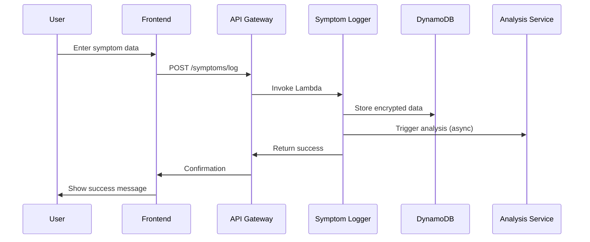
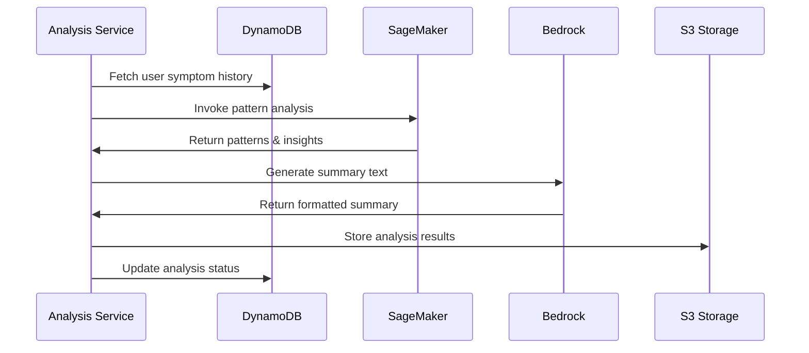
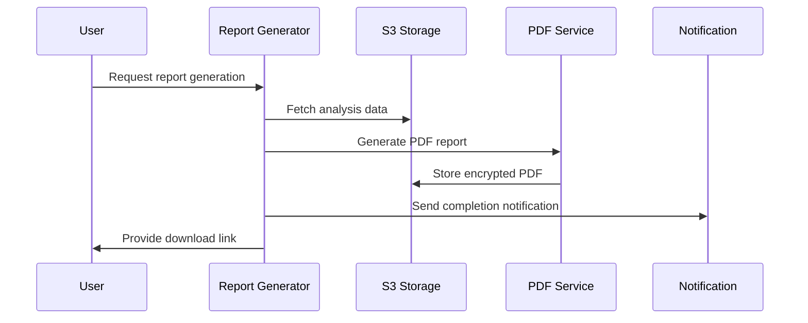

# Ovira AI - Women's Health Symptom Intelligence Platform
## System Design Document

### Version: 1.0
### Date: January 26, 2026
### Project: AI for Bharat Hackathon - Healthcare & Life Sciences Track

---

## 1. System Architecture Overview

Ovira AI is a cloud-native, serverless platform built on AWS that transforms daily symptom logs into structured, non-diagnostic summaries through responsible AI analysis. The system provides decision-support tools that encourage professional medical consultation while maintaining strict ethical boundaries around medical advice.

### 1.1 High-Level Architecture

```
┌─────────────────┐    ┌──────────────────┐    ┌─────────────────┐
│   Web/Mobile    │    │   API Gateway    │    │  Lambda Services│
│   Frontend      │◄──►│   + Cognito      │◄──►│   Microservices │
└─────────────────┘    └──────────────────┘    └─────────────────┘
                                │                        │
                                ▼                        ▼
┌─────────────────────────────────────────────────────────────────┐
│                        AI Processing Layer                       │
│  ┌─────────────────┐              ┌─────────────────────────────┐│
│  │ Amazon Bedrock  │              │     Amazon SageMaker        ││
│  │ (LLM Services)  │              │   (Pattern Analysis)        ││
│  └─────────────────┘              └─────────────────────────────┘│
└─────────────────────────────────────────────────────────────────┘
                                │
                                ▼
┌─────────────────────────────────────────────────────────────────┐
│                         Data Layer                              │
│  ┌─────────────────┐              ┌─────────────────────────────┐│
│  │   DynamoDB      │              │         Amazon S3           ││
│  │ (User & Symptom │              │  (Reports & ML Models)      ││
│  │     Data)       │              │                             ││
│  └─────────────────┘              └─────────────────────────────┘│
└─────────────────────────────────────────────────────────────────┘
```

### 1.2 Core Design Principles

- **Serverless-First**: Minimize operational overhead and enable automatic scaling
- **Security by Design**: End-to-end encryption following healthcare security best practices
- **Responsible AI**: Non-diagnostic outputs with clear limitations and transparency
- **Decision-Support Only**: Provides insights that encourage professional medical consultation
- **Privacy-Centric**: Minimal data collection with user consent and control
- **Multilingual Support**: Inclusive design for diverse user populations

---

## 2. Component Design

### 2.1 Frontend Layer

#### 2.1.1 Web Application
- **Technology**: React.js with TypeScript
- **Hosting**: AWS Amplify for CI/CD and hosting
- **Features**:
  - Responsive design for desktop and tablet access
  - Progressive Web App (PWA) capabilities
  - Offline symptom logging with sync capabilities
  - Real-time dashboard updates

#### 2.1.2 Mobile Application (Future Enhancement)
- **Technology**: React Native for cross-platform development
- **Distribution**: Future enhancement - App Store and Google Play Store
- **Planned Features**:
  - Native mobile experience
  - Push notifications for logging reminders
  - Biometric authentication support
  - Offline-first architecture

#### 2.1.3 User Interface Components
```
┌─────────────────────────────────────────────────────────────┐
│                    Authentication                           │
├─────────────────────────────────────────────────────────────┤
│  Dashboard  │  Symptom Logging  │  Reports  │  Chat Assistant│
├─────────────────────────────────────────────────────────────┤
│              Settings & Privacy Controls                    │
└─────────────────────────────────────────────────────────────┘
```

### 2.2 API Gateway Layer

#### 2.2.1 Amazon API Gateway Configuration
- **Type**: REST API with OpenAPI 3.0 specification
- **Authentication**: AWS Cognito integration
- **Rate Limiting**: Per-user and global throttling
- **Monitoring**: CloudWatch integration for metrics and logging

#### 2.2.2 API Endpoints Structure
```
/api/v1/
├── /auth
│   ├── POST /login
│   ├── POST /register
│   └── POST /refresh
├── /symptoms
│   ├── POST /log
│   ├── GET /history
│   └── PUT /update/{id}
├── /analysis
│   ├── POST /generate-summary
│   └── GET /patterns/{timeframe}
├── /reports
│   ├── GET /list
│   ├── GET /{id}/download
│   └── POST /generate
└── /chat
    ├── POST /message
    └── GET /history
```

### 2.3 Lambda Services Architecture

#### 2.3.1 Symptom Logging Service
```python
# Lambda Function: symptom-logging-service
Runtime: Python 3.11
Memory: 512 MB
Timeout: 30 seconds

Responsibilities:
- Validate symptom input data
- Encrypt sensitive information
- Store in DynamoDB
- Trigger analysis workflows
```

**Input Schema**:
```json
{
  "userId": "string",
  "date": "ISO-8601",
  "symptoms": {
    "menstrualFlow": "none|light|moderate|heavy",
    "painLevel": "0-10",
    "mood": "array of mood indicators",
    "sleepQuality": "1-5",
    "energyLevel": "1-5",
    "additionalNotes": "string"
  }
}
```

#### 2.3.2 AI Analysis Service
```python
# Lambda Function: ai-analysis-service
Runtime: Python 3.11
Memory: 512 MB (prototype phase)
Timeout: 3 minutes

Responsibilities:
- Aggregate symptom data
- Invoke SageMaker endpoints
- Generate non-diagnostic pattern insights
- Create statistical indicators (decision-support only)
```

**Analysis Pipeline**:
1. Data preprocessing and validation
2. Pattern recognition using SageMaker
3. Trend analysis and correlation detection
4. Non-diagnostic statistical indicator calculation
5. Summary generation via Bedrock (decision-support format with medical consultation encouragement)

#### 2.3.3 Report Generation Service
```python
# Lambda Function: report-generation-service
Runtime: Python 3.11
Memory: 512 MB (prototype phase)
Timeout: 90 seconds

Responsibilities:
- Compile analysis results
- Generate PDF reports (non-diagnostic)
- Store in S3 with encryption
- Send notification to user
```

**Report Structure**:
- Executive Summary (AI-generated, non-diagnostic, decision-support)
- Symptom Timeline Visualization
- Pattern Analysis Results (statistical only, encourages medical consultation)
- Non-diagnostic Statistical Indicators (no medical interpretation)
- Clear Recommendations for Healthcare Consultation

### 2.4 AI Processing Layer

#### 2.4.1 Amazon Bedrock Integration
```yaml
Model Selection:
  Primary: Claude 3 Haiku (cost-effective, fast)
  Fallback: Titan Text Express
  
Use Cases:
  - Non-diagnostic symptom summarization
  - Multilingual chatbot responses (educational only)
  - Health education content generation
  - Decision-support report narratives

Safety Measures:
  - Custom guardrails preventing medical diagnosis
  - Response filtering for diagnostic language
  - Bias detection and mitigation
  - Consistent encouragement of professional consultation
```

#### 2.4.2 Amazon SageMaker Services
```yaml
Endpoints (Prototype Phase):
  pattern-analysis-endpoint:
    Model: Custom statistical model for pattern detection
    Instance: ml.t3.small (cost-optimized for prototype)
    Auto-scaling: 1-2 instances
    
  risk-scoring-endpoint:
    Model: Statistical analysis model (non-diagnostic only)
    Instance: ml.t3.small
    Auto-scaling: 1-2 instances

Training Pipeline:
  Data: Synthetic and publicly available health datasets only
  Validation: Cross-validation with holdout sets
  Monitoring: Basic model performance tracking
  Note: No real patient data used in training
  Scope: Prototype-level accuracy targets
```

### 2.5 Data Layer Architecture

#### 2.5.1 Amazon DynamoDB Design
```yaml
Tables:
  Users:
    Partition Key: userId (String)
    Attributes: profile, preferences, created_at
    Encryption: At-rest with KMS
    
  Symptoms:
    Partition Key: userId (String)
    Sort Key: timestamp (String)
    GSI: date-index for time-based queries
    TTL: Optional data retention policy
    
  Reports:
    Partition Key: userId (String)
    Sort Key: reportId (String)
    Attributes: s3_location, generated_at, status
    
  ChatHistory:
    Partition Key: userId (String)
    Sort Key: sessionId#timestamp (String)
    TTL: 90 days automatic cleanup
```

#### 2.5.2 Amazon S3 Storage Strategy (Prototype Phase)
```yaml
Buckets:
  ovira-reports-prototype:
    Purpose: Generated PDF reports
    Encryption: SSE-KMS
    Lifecycle: Standard storage (future enhancement: archival)
    
  ovira-ml-models:
    Purpose: SageMaker model artifacts
    Versioning: Enabled
    Replication: Future enhancement for production
    
  ovira-static-assets:
    Purpose: Frontend assets and documentation
    CDN: CloudFront distribution (planned scalability feature)
    Caching: Basic caching strategy
```

---

## 3. Data Flow Architecture

### 3.1 Symptom Logging Flow


### 3.2 AI Analysis Flow


### 3.3 Report Generation Flow


---

## 4. Security & Privacy Design

### 4.1 Authentication & Authorization

#### 4.1.1 AWS Cognito Configuration
```yaml
User Pool:
  MFA: Optional (SMS/TOTP)
  Password Policy: 
    - Minimum 8 characters
    - Require uppercase, lowercase, numbers
    - Account lockout after 5 failed attempts
  
Identity Pool:
  Authenticated Role: Limited DynamoDB/S3 access
  Unauthenticated Role: No access
  
Social Providers:
  - Google OAuth 2.0
  - Apple Sign-In
```

#### 4.1.2 IAM Roles & Policies
```json
{
  "Version": "2012-10-17",
  "Statement": [
    {
      "Effect": "Allow",
      "Action": [
        "dynamodb:GetItem",
        "dynamodb:PutItem",
        "dynamodb:Query"
      ],
      "Resource": "arn:aws:dynamodb:*:*:table/ovira-*",
      "Condition": {
        "ForAllValues:StringEquals": {
          "dynamodb:LeadingKeys": ["${cognito-identity.amazonaws.com:sub}"]
        }
      }
    }
  ]
}
```

### 4.2 Data Encryption Strategy

#### 4.2.1 Encryption at Rest
- **DynamoDB**: AWS KMS encryption with customer-managed keys
- **S3**: SSE-KMS with automatic key rotation
- **Lambda**: Environment variables encrypted with KMS

#### 4.2.2 Encryption in Transit
- **API Gateway**: TLS 1.3 minimum
- **Frontend**: HTTPS only with HSTS headers
- **Internal Services**: VPC endpoints for AWS service communication

### 4.3 Privacy Controls

#### 4.3.1 Data Minimization
```yaml
Collection Principles:
  - Collect only necessary symptom data
  - No personally identifiable health information
  - User-controlled data retention periods
  - Granular consent management

User Rights:
  - Data export (JSON/PDF format)
  - Account deletion with data purging
  - Consent withdrawal options
  - Access logs and audit trails
```

#### 4.3.2 Healthcare Security Best Practices
- **Data Protection**: Following healthcare security and privacy best practices
- **Access Control**: Role-based permissions and audit trails
- **Encryption**: Industry-standard encryption at rest and in transit
- **Privacy by Design**: Minimal data collection with user control

---

## 5. Scalability & Reliability Design

### 5.1 Serverless Scaling Strategy (Prototype Phase)

#### 5.1.1 Lambda Concurrency Management
```yaml
Target Concurrency (Prototype):
  symptom-logging: 25 concurrent executions
  ai-analysis: 10 concurrent executions
  report-generation: 5 concurrent executions

Provisioned Concurrency:
  api-gateway-authorizer: 2 warm instances
  
Dead Letter Queues:
  All Lambda functions configured with DLQ
  CloudWatch alarms for DLQ message counts
```

#### 5.1.2 Database Scaling (Prototype Phase)
```yaml
DynamoDB:
  Billing Mode: On-demand (auto-scaling)
  Point-in-time Recovery: Enabled
  Global Tables: Future enhancement for multi-region
  
Read/Write Patterns:
  Symptoms Table: Write-heavy, time-series queries
  Users Table: Read-heavy, low write volume
  Reports Table: Burst read patterns
```

### 5.2 Fault Tolerance & Monitoring (Prototype Phase)

#### 5.2.1 High Availability
```yaml
Primary Region: us-east-1
Backup Strategy:
  - DynamoDB point-in-time recovery
  - S3 versioning and lifecycle policies
  - Lambda deployment across multiple AZs
  - Basic health monitoring

Future Enhancements:
  - Route 53 health checks and failover
  - Cross-region replication
  - Advanced disaster recovery
```

#### 5.2.2 Monitoring & Alerting (Prototype Phase)
```yaml
CloudWatch Metrics:
  - Lambda error rates and duration
  - API Gateway 4xx/5xx errors
  - DynamoDB throttling events
  - SageMaker endpoint latency

Target Alert Thresholds:
  - Error rate > 5% (10-minute window)
  - Response time > 10 seconds (P95)
  - Failed authentication attempts > 25/hour
```

---

## 6. Responsible AI Design

### 6.1 Non-Diagnostic Framework

#### 6.1.1 Language Guidelines
```yaml
Approved Terminology:
  - "Symptom patterns suggest..."
  - "Consider discussing with healthcare provider..."
  - "Statistical indicators show..."
  - "Educational information about..."
  - "Decision-support insights..."

Prohibited Language:
  - "Diagnosis", "Diagnose", "Medical condition"
  - "Treatment", "Cure", "Medicine"
  - "Disease", "Illness", "Disorder"
  - Specific medical condition names
  - Any diagnostic or treatment recommendations
```

#### 6.1.2 AI Guardrails Implementation
```python
# Bedrock Guardrail Configuration
guardrail_config = {
    "name": "ovira-medical-safety",
    "blocked_input_messaging": "I cannot provide medical diagnoses or treatment advice.",
    "blocked_outputs_messaging": "I can only provide symptom summaries and educational information.",
    "content_policy": {
        "filters": [
            {
                "type": "MEDICAL_DIAGNOSIS",
                "input_strength": "HIGH",
                "output_strength": "HIGH"
            },
            {
                "type": "MEDICAL_TREATMENT",
                "input_strength": "HIGH", 
                "output_strength": "HIGH"
            }
        ]
    },
    "word_policy": {
        "words": ["diagnose", "treatment", "cure", "disease", "prescribe"],
        "action": "BLOCK"
    }
}
```

### 6.2 Transparency & User Education

#### 6.2.1 AI Disclosure Framework
```yaml
Required Disclosures:
  - "AI-generated summary based on your symptom logs"
  - "Decision-support tool only - not medical advice"
  - "Not a substitute for professional medical consultation"
  - "Always consult healthcare provider for medical concerns"
  - "Based on patterns, not diagnostic criteria"

User Interface Elements:
  - Clear AI badges on generated content
  - "Learn More" links to AI explanation pages
  - Confidence scores for pattern analysis
  - Data source transparency
  - Prominent "Consult Doctor" call-to-action buttons
```

#### 6.2.2 Bias Mitigation Strategy
```yaml
Training Data Diversity:
  - Multi-ethnic synthetic datasets
  - Age-diverse symptom patterns
  - Socioeconomic representation
  - Geographic diversity in health patterns

Ongoing Monitoring:
  - Bias detection in AI outputs
  - Fairness metrics across user groups
  - Regular model retraining
  - User feedback integration
```

### 6.3 Synthetic Data Usage

#### 6.3.1 Data Sources
```yaml
Training Data Sources:
  - Synthetic and publicly available health datasets only
  - No real patient data used in any training process
  - Demographically diverse synthetic populations
  - Statistical health pattern datasets

Generation Process:
  - Privacy-preserving synthetic data generation
  - Statistical distribution preservation
  - Correlation pattern maintenance
  - Bias mitigation in synthetic populations
```

---

## 7. Future Enhancements

### 7.1 Voice Input Integration (Future Scope)

#### 7.1.1 Amazon Transcribe Integration
```yaml
Implementation Plan:
  Phase 1: Voice-to-text for symptom logging
  Phase 2: Natural language symptom parsing
  Phase 3: Multilingual voice support
  
Technical Requirements:
  - Real-time streaming transcription
  - Medical vocabulary customization
  - Privacy-preserving audio processing
```

### 7.2 Offline Mode Capabilities (Future Scope)

#### 7.2.1 Progressive Web App Enhancement
```yaml
Offline Features:
  - Local symptom data storage (IndexedDB)
  - Background sync when online
  - Cached educational content
  - Offline-first architecture patterns
```

### 7.3 Healthcare System Integration (Future Scope)

#### 7.3.1 Standards Compliance
```yaml
Future Integration Standards:
  - Healthcare data exchange standards
  - OAuth 2.0 for healthcare systems
  - Structured data export formats
  - Patient consent management systems

Data Exchange:
  - Structured symptom summaries
  - Timeline visualizations
  - Statistical indicator reports
  - User consent documentation
```

---

## 8. Performance Requirements (Prototype Phase)

### 8.1 Target Response Time Goals
```yaml
API Endpoints (Prototype Targets):
  - Authentication: < 2s (P95)
  - Symptom logging: < 3s (P95)
  - Dashboard loading: < 5s (P95)
  - Report generation: < 90s (P95)
  - Chat responses: < 8s (P95)

AI Processing (Prototype Targets):
  - Pattern analysis: < 30s
  - Summary generation: < 45s
  - Statistical calculation: < 20s
```

### 8.2 Availability Goals (Prototype Phase)
```yaml
Target Service Levels:
  - Uptime: 95%+ (suitable for hackathon demo and early testing)
  - Error Rate: < 5%
  - Data Durability: 99.9% (DynamoDB standard)
  
Maintenance:
  - Planned maintenance windows as needed
  - Basic monitoring and alerting for key metrics
  - Manual intervention acceptable for prototype phase
```

---

## 9. Cost Optimization Strategy (Prototype Phase)

### 9.1 Resource Optimization
```yaml
Lambda Functions:
  - Right-sized memory allocation for prototype
  - Efficient code for cost reduction
  - On-demand scaling only
  
Storage:
  - S3 Standard for active data
  - DynamoDB on-demand billing
  - Basic CloudFront setup (future enhancement)

AI Services:
  - Bedrock on-demand pricing
  - SageMaker Serverless Inference
  - Cost monitoring and budget alerts
  - Prototype-level usage patterns
```

### 9.2 Future Production Enhancements
```yaml
Planned Scalability Features:
  - Advanced caching strategies
  - Multi-region deployment
  - Reserved capacity for predictable workloads
  - Intelligent tiering for storage
  - Advanced monitoring and optimization
```

---

## Conclusion

This design document outlines a responsible, hackathon-appropriate architecture for the Ovira AI platform prototype. The serverless AWS-based approach ensures cost-effectiveness while maintaining security standards and ethical AI practices suitable for demonstration and early-stage development.

The design emphasizes:
- **Non-diagnostic outputs only** - No medical diagnosis or treatment advice
- **Decision-support focus** - Tools that encourage professional medical consultation
- **Responsible AI** - Synthetic data training with strict guardrails
- **Healthcare security best practices** - Following industry standards without over-claiming compliance
- **Prototype-to-production pathway** - Suitable for hackathon demo with clear future enhancement roadmap

The modular design allows for incremental development during the hackathon while providing a solid foundation for future production-level enhancements including multi-region deployment, advanced monitoring, and enterprise-grade compliance features.

**Prototype Scope**: Focused on core functionality demonstration with target performance goals
**Future Roadmap**: Clear path to production-level scalability and compliance

---

**Document Status**: Prototype Design v1.0  
**Target**: AI for Bharat Hackathon MVP  
**Next Review**: Technical Architecture Review